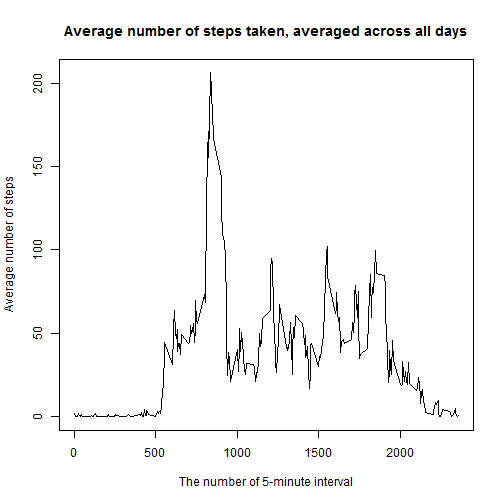
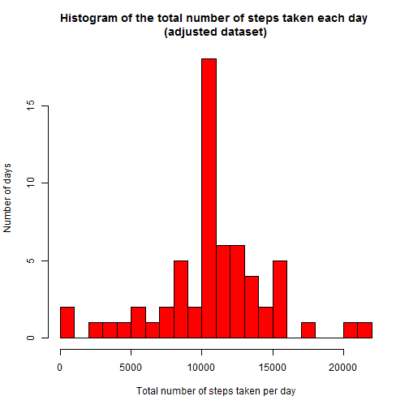

## Loading and preprocessing the data
Setting the US locale:

```r
Sys.setlocale(category = "LC_ALL", locale = "English_United States.1252")
```
Unzipping data archive if it is necessery:

```r
unzip(zipfile="activity.zip", overwrite = FALSE, exdir = "data")
```
Reading the data and converting dates to the Date class:

```r
DataTab <- read.csv("data/activity.csv", header = TRUE, na.strings = "NA")
DataTab$date <- as.Date(DataTab$date, format = "%Y-%m-%d")
```


## What is mean total number of steps taken per day?
Aggragating the data by days:

```r
StepsByDays <- aggregate(DataTab$steps, by=list(date=DataTab$date), FUN="sum", na.rm = TRUE)
```
The histogram of the total number of steps taken each day:

```r
hist(StepsByDays$x, breaks=20, col="red", xlab="Total number of steps taken per day", ylab="Number of days", main="Histogram of the total number of steps taken each day")
```

 

The mean of the total number of steps taken per day:

```r
mean(StepsByDays$x)
```

```
## [1] 9354.23
```
The median of the total number of steps taken per day:

```r
median(StepsByDays$x)
```

```
## [1] 10395
```

## What is the average daily activity pattern?
Calculating the mean of steps number, averaged across all days 

```r
StepsByIntervals <- aggregate(DataTab$steps, by=list(interval=DataTab$interval), FUN="mean", na.rm = TRUE)
```
Taking a plot:

```r
plot(x=StepsByIntervals$interval, y=StepsByIntervals$x, type="l", xlab="The number of 5-minute interval", ylab="Average number of steps", main="Average number of steps taken, averaged across all days")
```

 

Taking the 5-minute interval, that contains the maximum number of steps:

```r
StepsByIntervals[order(StepsByIntervals$x, decreasing=TRUE), 1][1]
```

```
## [1] 835
```

## Imputing missing values
Taking the total number of missing values in the dataset:

```r
sum(is.na(DataTab$steps))
```

```
## [1] 2304
```
Filling missing values by the mean for appropriate 5-minute interval:

```r
ImputedData <- merge(DataTab, StepsByIntervals, by="interval", all=TRUE)
ImputedData$steps <- ifelse(is.na(ImputedData$steps), ImputedData$x, ImputedData$steps)
ImputedData <- ImputedData[c("steps","date","interval")]
```
Aggragating the data by days (for adjusted dataset) and getting the mean, the median and the histogramm of number total of steps taken per day:

```r
StepsByDays2 <- aggregate(ImputedData$steps, by=list(date=ImputedData$date), FUN="sum", na.rm = TRUE)
hist(StepsByDays2$x, breaks=20, col="red", xlab="Total number of steps taken per day", ylab="Number of days", main="Histogram of the total number of steps taken each day \n(adjusted dataset)")
```

 

```r
mean(StepsByDays2$x)
```

```
## [1] 10766.19
```

```r
median(StepsByDays2$x)
```

```
## [1] 10766.19
```

## Are there differences in activity patterns between weekdays and weekends?

Creating a new factor variable in the dataset with two levels – “weekday” and “weekend” indicating whether a given date is a weekday or weekend day

```r
ImputedData$wDay = factor(weekdays(ImputedData$date, abbreviate = TRUE) %in% c("Sun","Sat"), labels = c("Weekday","Weekend"))
```

Making a plot:

```r
StepsByIntervals2 <- aggregate(ImputedData$steps, by=list(interval=ImputedData$interval, wDay=ImputedData$wDay), FUN="mean", na.rm = TRUE)

library(lattice)
xyplot(x ~ interval | wDay, data=StepsByIntervals2, type="l",
    ylab = "", origin = 0, layout = c(1,2), 
	main = "The average number of steps taken, averaged \nacross all weekday days or weekend days")
```

 

